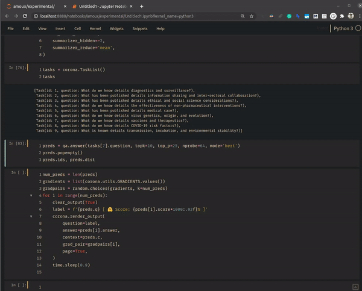

# ⚕ corona_nlp

The current status of the project is experimental 🔬

## Docs

> `CORD19Dataset.__init__` ***method***

Construct a `CORD19Dataset` object.  Initialize with a single path or a list paths pointing to the directory with JSON files, e.g., `/../dir/*.json`

```python
import corona_nlp as corona

root = corona.Path("path/to/CORD-19-research-challenge/2020-03-13/")
source = [p.joinpath(p.name) for p in root.iterdir() if p.is_dir()]

dataset = corona.CORD19Dataset(
    source=source,
    index_start=1,
    sort_first=True,
    nlp_model='en_core_sci_sm',
    text_keys=('body_text',),
)
print(dataset)
...
# CORD19Dataset(papers: 13202, files_sorted: True, source: [
#   comm_use_subset, noncomm_use_subset, pmc_custom_license, biorxiv_medrxiv,
# ])
```

> `CORD19Dataset.sample` ***method***

| name    | type                        | description                                                                     |
|---------|-----------------------------|---------------------------------------------------------------------------------|
| *k*     | int                         | Sample size, if `k < max_ids`; random sample. Otherwise, `-1` for all ids.      |
| *s*     | int                         | Split of ids, `id` is based on the order of path(s) passed and `n` directories. |
| *seed*  | Optional[Union[int, float]] | Random seed if not None.                                                        |
| returns | List[int]                   | Returns a list of paper ids.                                                    |

```python
sample = dataset.sample(s=0)  # e.g., All ids from the biorxiv_medrxiv directory
sample = dataset.sample(k=-1) # Returns all ids available in order.
sample = dataset.sample(k=1000) # 1K randomly selected ids, e.g., from all 45941
```

> `CORD19Dataset.batch` ***method***

| name      | type       | description                                                   |
|-----------|------------|---------------------------------------------------------------|
| *sample*  | List[int]  | A list of integer sequences.                                  |
| *minlen*  | int        | Minimum length of a string to consider valid.                 |
| *workers* | int        | Number of cores to use, if None; obtained from `cpu_count()`. |
| returns   | **Papers** | The newly constructed object.                                 |

```python
sample = dataset.sample(-1)
papers = dataset.batch(sample,  minlen=15, workers=None)
...
# papers: 24% ████     | 3112/13202 [09:49<19:51, 8.47it/s]
```

- After extracting the text from the JSON files, pre-processing, cleaning, and sentence-tokenization we get a newly constructed `Papers` object with a container `Dict[int, List[str]]`. holding all the sentences.

> Tip: I recommend using the spaCy model `en_core_sci_sm` for any texts in the dataset as it properly detects sentence boundaries, see below of a real example:

```python
import spacy
en_core_web_sm = spacy.load('en_core_web_sm')
en_core_sci_sm = spacy.load('en_core_sci_sm')

texts = cord19.load_paper(200)['abstract'][0]['text']
web_doc = en_core_web_sm(texts)
sci_doc = en_core_sci_sm(texts)
print(len(web_doc), len(sci_doc))
...
#  (246, 236)  <- diff?
```

- Below we can see the contrast in how the models recognize sentence boundaries; `en-core-web-sm` starts splitting at `" ( "` ? that doesn't make sense!? if this is done here; where else it will do it? Given the fact the text **is** scientific literature, we can expect equations, many abbreviations, and symbols - all destroyed because we used the wrong tokenizer. Meanwhile, `en_core_sci_sm` has no issues 🥇 [scispacy - SpaCy models for biomedical text processing](https://allenai.github.io/scispacy/)

```python
# run this nice for loop both models
for idx, sent in enumerate(doc.sents): print(f'{idx}:\t{sent}')
```

- Tokenization with the `en_core_web_sm` model

```bash
2: We analyzed ... pulmonary artery endothelial cells (hPAECs).
3: The effect of ... electric resistance, molecule trafficking, calcium (
4: Ca 2+ ) homeostasis, gene expression and proliferation studies.
```

- Tokenization with the `en_core_sci_sm` model.

```bash
2: We analyzed ... pulmonary artery endothelial cells (hPAECs).
3: The effect of ... electric resistance, molecule trafficking, calcium (Ca 2+ ) homeostasis, gene expression and proliferation studies.
```

> `corona_nlp.core.Papers.__str__` **method**

- Wow 🤔 `13,202` papers produce `1,890,230` million sentences and `60,847,005` million tokens! It takes about ~30 minutes with *SSD* and around ~40 on *HDD*, but it really depends on hardware.

```python
print(papers)
...
# Papers(avg_seqlen=32.19, num_papers=13202, num_sents=1890230, num_tokens=60847005)
```

> `SentenceTransformer.__init__` **method**

```python
encoder = corona.SentenceTransformer('model_name_or_path')
embedding = encoder.encode(papers, batch_size=8)
...
# batches: 96% ██████████████ | 36585/38168 [17:10<01:17, 20.38it/s]
```

> `corona_nlp.indexing.fit_index_ivf_hnsw` **method**

### NOTE

---

The following method requires `faiss,` which should be easy to install for both *Linux* and *MacOS*. Except for *Windows* which needs to be built from source, read more here: [windows support? | issue<1437>](https://github.com/facebookresearch/faiss/issues/1437)

- Install faiss with `CUDA or CPU` (I have only used the *CPU* version and haven't experienced any issues even at `2 million` dense vectors runs extremely fast. See official repo: [faiss github](https://github.com/facebookresearch/faiss)

- **cpu-version**:

  - `conda install faiss-cpu -c pytorch`

- **gpu-version** [`8.0, 9.0, 10.0`] replace `X` with your version (currently using on version=`10.1`).

  - `conda install faiss-gpu cudatoolkit=X.0 -c pytorch`

```python
index_ivf = corona.fit_index_ivf_hnsw(embedding,  metric='l2')
print(index_ivf.is_trained)
...
# True
```

> `ScibertQuestionAnswering.__init__` **method**

- The following table defines the minimum arguments required to construct a new `ScibertQuestionAnswering` object.

| name      | type                            | description              |
|-----------|---------------------------------|--------------------------|
| *papers*  | Union[str, Papers]              | A path or papers object. |
| *index*   | Union[str, faiss.IndexIVFFlat]  | A path or index object   |
| *encoder* | Union[str, SentenceTransformer] | A path or model object   |

```python
from corona_nlp.engine import ScibertQuestionAnswering

qa =  ScibertQuestionAnswering(papers, index_ivf, encoder)
print(qa.all_model_devices)
...
# {'summarizer_model_device': device(type='cuda'),
#  'sentence_transformer_model_device': device(type='cuda'),
#  'question_answering_model_device': device(type='cpu')}
```

> `QuestionAnsweringEngine.answer` **method**

| name       | type                      | description                                                        |
|------------|---------------------------|--------------------------------------------------------------------|
| *question* | str                       | Question(s) to query the QA model (split by sentence tokenization) |
| *topk*     | int                       | Number of answers to return (chosen by likelihood)                 |
| *top_p*    | int                       | A path or model object                                             |
| *nprobe*   | int                       | index search probe value                                           |
| *mode*     | str                       | Compressor mode to use on context; `'bert', 'freq'`                |
| returns    | *QuestionAnsweringOutput* | Object holding the predictions of the model(s)                     |

---

- The subsequent keyword arguments can be used in `QuestionAnsweringEngine.answer` method, which then gets passed to `transformers.QuestionAnsweringPipeline.__call__`. Click in [here](https://huggingface.co/transformers/main_classes/pipelines.html#transformers.QuestionAnsweringPipeline.__call__) to read the official  HuggingFace documentation.

| **kwargs                   | type | description                                                                             |
|----------------------------|------|-----------------------------------------------------------------------------------------|
| *doc_stride*               | int  | (default=`128`) If input length overlaps split by chunks.                               |
| *max_answer_len*           | int  | (default=`15`) Max length of predicted answers.                                         |
| *max_seq_len*              | int  | (default=`384`) Max length of the total sentence (context+question) after tokenization. |
| *max_question_len*         | int  | (default=`64`) Max length of the question after tokenization.                           |
| *handle_impossible_answer* | bool | (default=`False`) Whether or not we accept impossible as an answer.                     |

---

### Question Answering

> Open book question-answering on CORD19-Dataset literature

- base-model: `scibert-scivocab-cased`
- finetuned: CORD19-Dataset `nli-stsb-mean-tokens` (using the `sentence-transformers` library).
- downstream-task: question-answering `SQUAD 2.0`

```python
question =  ("What has been published concerning systematic, holistic approach to"
            " diagnostics (from the public health surveillance perspective to being"
            " able to predict clinical outcomes)?")

preds = qa.answer(question,  topk=5, top_p=25, nprobe=64, mode='bert')
preds.popempty()  # quickly pop any empty answers from the list.

print(preds.ids, preds.dist)
...
```

- Each sentence id with its respective distance (nearest-neighbor to query/question):

```bash
(array([[179943,  38779,  48340, 171641,  11026,  16090, 132451,  10551,
         231547,  32627, 203359, 123822, 231157,  59945, 333167, 203328,
          37302,  74584,   1534, 425932, 261597, 268659, 397260,  27072,
         117127]]),
 array([[114.0309 , 119.05531, 127.31623, 128.10754, 134.01633, 135.51642,
         137.91711, 138.64822, 139.26003, 141.16678, 142.14966, 144.36464,
         147.06775, 147.06958, 147.22888, 148.9502 , 149.55885, 149.9512 ,
         150.12485, 150.1834 , 150.33147, 151.04956, 151.89029, 152.3189 ,
         152.47305]], dtype=float32))
```

- In the following output we can see all the predicted answers and get a nice view of each answer's information.

```python
list(preds)
...
# [ModelOutput(score=0.02010919339954853, start=11, end=35, answer='laboratory confirmation,'),
#  ModelOutput(score=0.00906957034021616, start=133, end=143, answer='sequencing.'),
#  ModelOutput(score=0.00279330019839108, start=40, end=143, answer='national reference, ...'),
#  ModelOutput(score=0.002625082153826952, start=11, end=21, answer='laboratory')]
```

- Get all spans `[(start, end)]` index of each answer. Both styles produce the same result.

```python
for span in preds: print(span.start, span.end)
preds.spans()
...
# [(11, 35), (133, 143), (40, 143), (11, 21)]
```

- It looks better in the notebook (Uses spacy's visualizer for displaying the question in a friendly format and highlighting the predicted answer). Check out the example notebook in the notebook directory of this repo.

```python
question = preds.q  # question
context = preds.c   # context

output = preds[2]  # e.g., iter all answer: [o.answer for o in preds]
answer = output.answer
corona.render_output(answer=answer, context=context, question=question)
```

```markdown
* Question

> What has been published concerning systematic, holistic approach to 
diagnostics (from the public health surveillance perspective to being 
able to predict clinical outcomes)?


- Context

In case of laboratory confirmation, `<< the national reference laboratory 
aims to obtain material from regional laboratories for further sequencing. ANSWER >>` 
An alternate measure of program success is the extent to which screening delays the 
first importation of cases into the community, possibly providing additional time 
to train medical staff, deploy public health responders or refine travel policies 
(Cowling et al., Unlike the UK national strategy documents and plans, the US National 
Health Information Infrastructure Strategy document (also known as "Information for Health") 
refers explicitly to GIS and real-time health and disease monitoring and states that "public 
health will need to include in its toolkit integrated data systems; high-quality 
community-level data; tools to identify significant health trends in real-time data streams; 
and geographic information systems" [48]. This thinktank is used to address matters related 
to combating new issues and to expand on the Saudi reach to the international scientific 
community. For the purpose of this paper, the following de�nition is used, "Public health 
surveillance is the ongoing systematic collection, analysis, interpretation and 
dissemination of health data for the planning, implementation and evaluation of 
public health action" (see Section 2.3 below). Finally, we discuss policy and 
logistical and technological obstacles to achieving a potential transformation 
of public health microbiology.
```

- Here's an example of the `render_output()` method shown above in a jupyter notebook:


